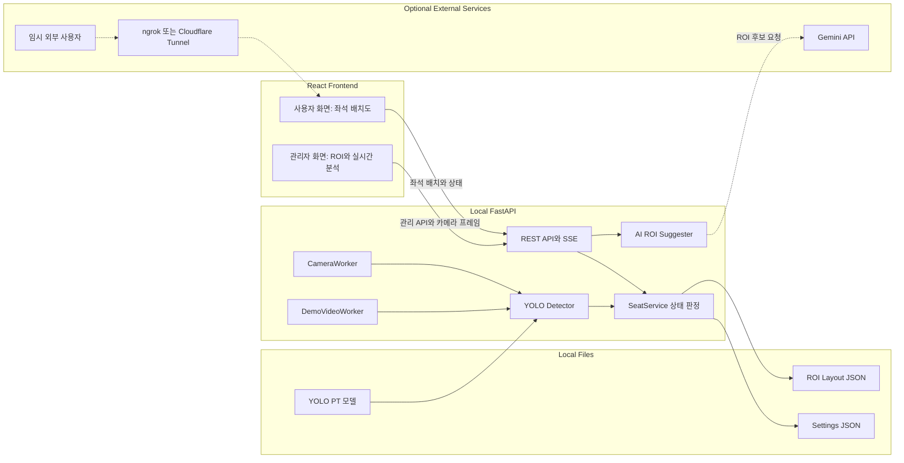

# YOLO Seat Monitor

YOLO와 카메라 영상을 이용해 도서관·독서실 좌석의 점유 상태와 노쇼를 판정하는 로컬 우선 웹 애플리케이션입니다.

카메라 입력, YOLO 추론, 좌석 상태 계산과 데이터 저장은 한 대의 로컬 노트북에서 처리합니다. 프론트엔드는 하나의 React 애플리케이션 안에서 사용자 화면과 관리자 화면을 구분하는 방향으로 개발합니다.

## 화면 구성

| 구분 | 제공 기능 |
|---|---|
| 사용자 화면 | 현재 좌석 배치도와 이용 가능 상태 조회 |
| 관리자 화면 | 카메라 화면, ROI 설정, AI ROI 후보 생성, 실시간 탐지 결과, 노쇼 기준 설정, 타이머 초기화, 시연 영상 분석 |

- 사용자에게는 좌석 선택에 필요한 배치와 상태만 보여줍니다.
- 관리자는 카메라와 탐지 결과를 보면서 좌석별 ROI와 운영 설정을 관리합니다.

## 주요 기능

- 노트북 웹캠, USB 카메라, Camo와 같은 가상 카메라 입력
- Ultralytics YOLO를 이용한 사람·소지품 탐지
- 다각형 ROI 기반 좌석별 탐지 결과 매칭
- `empty`, `occupied`, `away`, `noshow` 좌석 상태 판정
- SSE를 통한 좌석 상태 실시간 전송
- ROI와 노쇼 기준 시간의 로컬 JSON 저장
- 이미지와 Gemini를 이용한 초기 ROI 후보 생성
- 업로드 영상의 실제 속도 재생 및 YOLO 시연 분석
- 특정 좌석 또는 전체 좌석의 판정 타이머 초기화

## 아키텍처



### 실시간 분석 흐름

```text
카메라 또는 시연 영상
  → 최신 프레임 수집
  → YOLO 객체 탐지
  → 객체 중심점과 좌석 ROI 매칭
  → 시간 기반 좌석 상태 판정
  → REST 및 SSE로 프론트에 전달
```

카메라 분석과 업로드 영상 분석은 동시에 실행하지 않습니다. 시연 모드에 진입하면 카메라 분석을 멈추고, 시연 모드를 종료하면 카메라 모드로 복귀합니다.

## 좌석 상태 판정

| 상태 | 의미 |
|---|---|
| `empty` | 사람과 관리 대상 소지품이 감지되지 않음 |
| `occupied` | 사람이 일정 시간 연속으로 감지됨 |
| `away` | 사람은 없고 책·노트북·가방 등의 소지품만 감지됨 |
| `noshow` | `away` 상태가 설정한 노쇼 기준 시간을 초과함 |

현재 기본 판정값은 다음과 같습니다.

- YOLO 추론 주기: 1초
- 점유 확정: 사람을 2초간 연속 탐지
- 미탐지 보정: 객체가 잠깐 사라져도 3초간 이전 상태 유지
- 노쇼 기준: 기본 600초이며 `/api/settings`로 변경 가능
- 소지품 클래스: `backpack`, `handbag`, `suitcase`, `book`, `laptop`

좌석 상태와 타이머는 실행 중 메모리에 저장되며 서버를 재시작하면 초기화됩니다. ROI와 설정값은 JSON 파일에 저장되어 재시작 후에도 유지됩니다.

## 기술 스택

### Backend and Vision

- Python 3.12
- FastAPI, Pydantic v2, Uvicorn
- Ultralytics YOLO, PyTorch
- OpenCV
- Server-Sent Events
- JSON local storage
- Google Gemini API for optional ROI suggestions

### Frontend

- React, TypeScript, Vite
- 사용자 화면과 관리자 화면을 하나의 프론트엔드에서 라우팅으로 분리
- 사용자 화면은 좌석 배치도 중심의 읽기 전용 UI
- 관리자 화면은 ROI 편집과 카메라·영상 분석 관리 UI

자세한 기술 방향은 [TECH_STACK.md](TECH_STACK.md)를 참고하세요. 일부 초기 계획은 현재 구현 방향과 다를 수 있으며, 이 README의 화면 구성과 배포 방침을 우선합니다.

## 저장소 구조

```text
yoloSeatMonitor/
├─ backend/
│  ├─ api/                 # FastAPI 엔드포인트와 앱 실행 주기
│  ├─ domain/              # Pydantic 모델과 좌석 상태 서비스
│  ├─ repositories/        # ROI와 설정 JSON 저장소
│  └─ vision/              # 카메라, 영상 재생, YOLO, AI ROI 추천
├─ data/                   # 로컬 ROI와 설정 데이터
├─ docs/                   # API 및 백엔드 작업 문서
├─ models/                 # YOLO PT 모델
├─ prototype/              # 초기 UI 목업
├─ tests/                  # 백엔드 단위·API 테스트
├─ frontend/               # React 통합 프론트엔드 위치 예정
├─ requirements.txt
├─ TECH_STACK.md
└─ README.md
```

## 로컬 실행

### 1. 가상환경 생성

프로젝트 루트에서 실행합니다.

```powershell
py -3.12 -m venv .venv
```

### 2. 의존성 설치

```powershell
.\.venv\Scripts\python.exe -m pip install -r requirements.txt
```

### 3. 환경변수 설정

`.env.example`을 `.env`로 복사한 뒤 필요한 값을 수정합니다.

```dotenv
YOLO_MODEL_PATH=models/yolo26s.pt
CAMERA_SOURCE=0

# AI ROI 후보 생성을 사용할 때만 필요
GEMINI_API_KEY=
GEMINI_ROI_MODEL=gemini-3.7-flash

# 시연 영상 설정
DEMO_VIDEO_DIRECTORY=data/demo
MAX_DEMO_VIDEO_BYTES=524288000
```

`CAMERA_SOURCE`에는 OpenCV 카메라 번호 또는 영상 스트림 주소를 사용할 수 있습니다. Camo와 같은 가상 카메라는 Windows에서 확인된 장치 번호를 입력합니다.

### 4. 백엔드 실행

```powershell
.\.venv\Scripts\python.exe -m uvicorn backend.api.main:app --host 127.0.0.1 --port 8000
```

- API 주소: `http://127.0.0.1:8000`
- Swagger 문서: `http://127.0.0.1:8000/docs`
- 상태 확인: `http://127.0.0.1:8000/api/health`

카메라 프로그램이 장치를 먼저 점유하고 있으면 OpenCV가 프레임을 읽지 못할 수 있습니다. Camo를 사용할 때는 Camo 연결을 완료한 다음 백엔드를 실행하세요.

### 5. 프론트엔드 실행

프론트엔드가 이 저장소의 `frontend/`에 통합된 이후 다음과 같이 실행합니다.

```powershell
cd frontend
npm install
npm run dev
```

개발 중에는 프론트엔드의 `/api` 요청이 `http://127.0.0.1:8000`으로 전달되도록 Vite proxy를 사용합니다.

## 주요 API

| Method | Endpoint | 설명 |
|---|---|---|
| `GET` | `/api/health` | 서버, 카메라와 현재 분석 모드 확인 |
| `GET` | `/api/layout` | 카메라용 ROI 조회 |
| `PUT` | `/api/layout` | 카메라용 ROI 저장 |
| `POST` | `/api/layout/suggestions` | 첨부 이미지의 AI ROI 후보 생성 |
| `GET` | `/api/seats` | 현재 좌석 상태 조회 |
| `GET` | `/api/seats/stream` | 좌석 상태 변경 SSE 수신 |
| `POST` | `/api/seats/{seat_id}/reset` | 특정 좌석 판정 타이머 초기화 |
| `POST` | `/api/seats/reset` | 전체 좌석 판정 타이머 초기화 |
| `GET` | `/api/settings` | 노쇼 기준 설정 조회 |
| `PUT` | `/api/settings` | 노쇼 기준 설정 저장 |
| `GET` | `/api/camera/frame.jpg` | 현재 카메라 프레임 조회 |
| `POST` | `/api/demo/enter` | 시연 영상 모드 진입 |
| `POST` | `/api/demo/video` | 시연 영상 업로드 |
| `GET` | `/api/demo/preview.jpg` | 업로드 영상 첫 프레임 조회 |
| `GET`, `PUT` | `/api/demo/layout` | 시연 영상용 ROI 조회·저장 |
| `POST` | `/api/demo/start` | 영상 재생 및 YOLO 분석 시작 |
| `GET` | `/api/demo/stream` | 시연 영상 MJPEG 스트림 |
| `GET` | `/api/demo/status` | 시연 분석 진행 상태 조회 |
| `POST` | `/api/demo/stop` | 시연 분석 중지 |
| `POST` | `/api/demo/exit` | 시연 모드 종료 및 카메라 복귀 |

더 자세한 설명은 [백엔드 README](backend/README.md), [백엔드 작업 정리](docs/BACKEND_WORK_SUMMARY.md), [ROI 자동 설정 API](docs/ROI_AUTO_SETUP_API.md)를 참고하세요.

## 로컬 데이터

| 파일 | 내용 |
|---|---|
| `data/layout.json` | 실시간 카메라용 좌석 ROI |
| `data/demo_layout.json` | 업로드 영상 시연용 좌석 ROI |
| `data/settings.json` | 노쇼 기준 시간 |
| `data/demo/` | 실행 중 업로드된 임시 영상 |
| `models/*.pt` | YOLO 가중치 |

다른 운영 컴퓨터로 ROI를 옮길 때는 카메라 해상도와 구도가 같다는 전제에서 해당 JSON 파일을 함께 전달할 수 있습니다.

## 테스트

추가 패키지 없이 Python 기본 테스트 실행기로 전체 테스트를 실행할 수 있습니다.

```powershell
.\.venv\Scripts\python.exe -m unittest discover -s tests -v
```

## 임시 외부 공개

서비스는 기본적으로 로컬에서만 실행합니다. 시연이나 단기 사용자 확인이 필요할 때만 ngrok 또는 Cloudflare Tunnel을 실행해 사용자 화면을 임시로 공개합니다.

```text
외부 사용자
  → 임시 Tunnel 주소
  → React 사용자 화면
  → Vite proxy 또는 같은 Origin의 FastAPI API
  → 현재 좌석 배치와 상태
```

터널 프로세스를 종료하면 외부 공개도 함께 종료됩니다.

## 개발 방향

- 하나의 React 프론트엔드에서 사용자·관리자 화면 분리
- 사용자 화면은 좌석 배치와 이용 가능 상태에 집중
- 관리자 화면은 ROI, 카메라, 탐지 설정과 시연 기능 제공
- 임시 공개가 필요할 때만 ngrok 또는 Cloudflare Tunnel 사용
